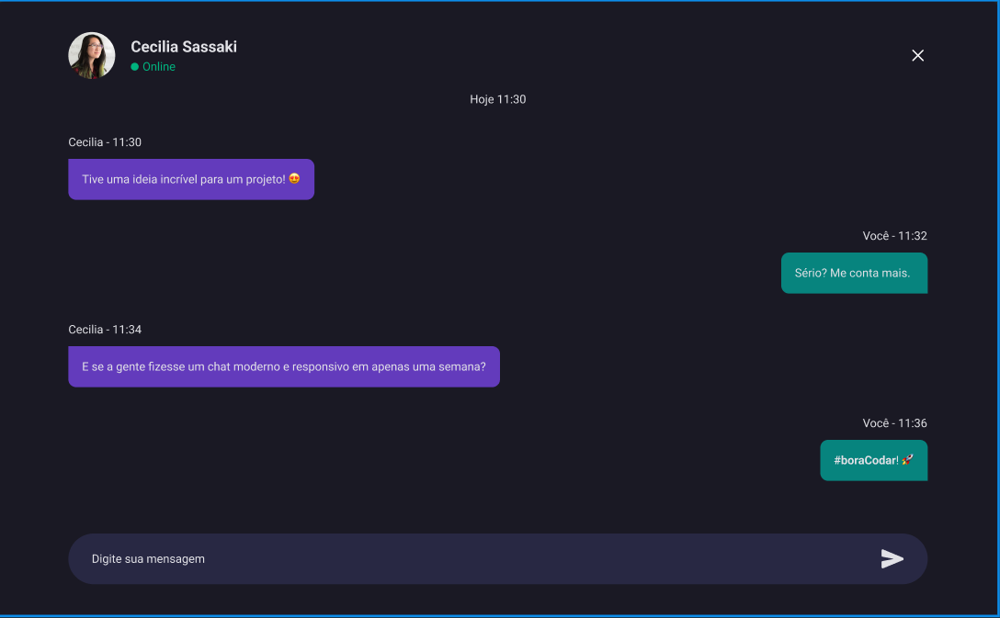

<h1>Projeto ReactJS</h1>
<h2>Chat-Rocket-App</h2>

<h3>Foi criado um projeto que simula um chat de bate papo esitlo zap</h3>

É um desafio proposto pelo time da RocketSeat que disponibiliza os templates

Com isso, posso treinar constantemente

Ferramentas utilizadas

<ul>
  <li>ViteJS</li>
  <li>ReactJS</li>
  <li>TypeScript</li>
  <li>Phosphor-icons</li>
  <li>styled-components</li>
</ul>

<h3>Maiores desafios</h3>

Compartilhar o mesmo input e button para 2 usuários enviarem mensagem um para o outro

Utilizei o useContext para compartilhar os estados e compartilhei apenas duas funções que envia

mensagem dos dois usuários ao mesmo tempo igual no zap ou Telegram

Imagem do projeto completo

